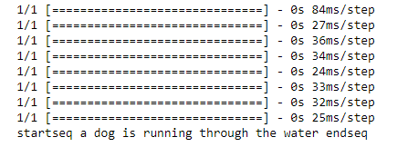

# Image Captioning using Neural Networks
We have made an attempt to generate caption using Neural Networks.

*Playground for Captioning Images.
## Input Image

## Output Description

## Based on
[https://arxiv.org/abs/1703.09137](https://arxiv.org/abs/1703.09137)

The dataset can be downloaded from below links.
..*[Flickr 8k Images](http://nlp.cs.illinois.edu/HockenmaierGroup/Framing_Image_Description/Flickr8k_Dataset.zip)
..*[Flickr 8k Text Data](http://nlp.cs.illinois.edu/HockenmaierGroup/Framing_Image_Description/Flickr8k_text.zip)
..*Download both the datasets and have it at one single folder. Change the path before you execute the notebook.
